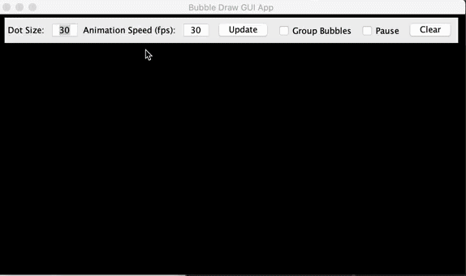
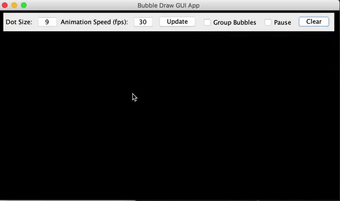
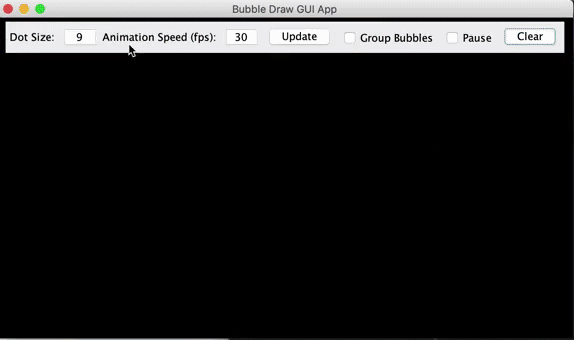

# BubbleDraw
## Objective
This app app was developed with the intent to learn how the paintComponent method for Java desktop apps development works. To update objects moving on the screen ins real time, the timer method was also used.

## App Features
As the mouse pointer clicks through the app window, bubbles are drawn onscreen, moving in a random direction each one of them, or in groups, defined by the user, as their position change across the screen in real time.

It is possible to clear the screen erasing all the objects on it:

The sizes of the bubbles can be changed through the mouse scroll button or typing in the corresponding field in the GUI, as well group the bubbles or pause the animation:

The speed of the animation can also be changed by altering the Frames per Second parameter:

